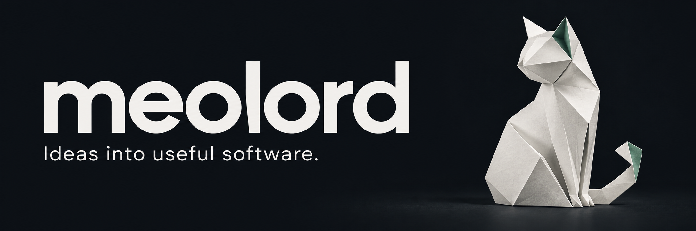

  

## Ideas into useful software.

I build AI applications, developer tools, and everyday utilities, with care for the user experience.

[Explore all projects](https://github.com/shenmuegit?tab=repositories)

### Current work

**[WhaleKey](https://github.com/shenmuegit/whalekey)**

An Android Chinese keyboard in early development, based on Fcitx5 Android. Exploring offline Pinyin input and on-device text rewriting.

`Kotlin` `Android` `On-device AI` · **Early development**

### Selected projects

**[StackCat](https://github.com/shenmuegit/StackCat)**  
Runtime call tracing and analysis for Java applications. Explore method calls, SQL, and performance bottlenecks.  
Java · Java Agent · Spring Boot

**[PestiGraph](https://github.com/shenmuegit/PestiGraph)**  
A pesticide registration knowledge graph built on Microsoft GraphRAG, with search, Q&A, and interactive visualization.  
Python · GraphRAG · Knowledge graphs

**[WordHook](https://github.com/shenmuegit/WordHook)**  
Learn English as you browse: highlight text for AI explanations and local text-to-speech, then save what you learn to Anki.  
JavaScript · Chrome extension · LLM

---

Feedback and suggestions are welcome in each project's Issues.
